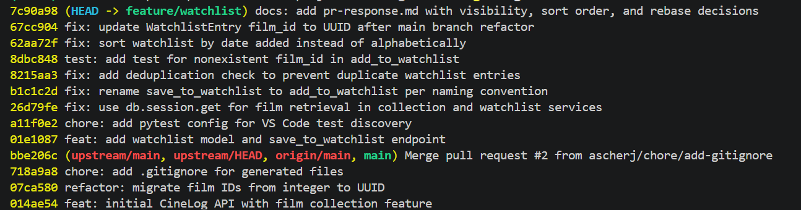

# PR Response Doc — CineLog Watchlist Feature

## AI Usage
<!-- Fill in at the end — how you used AI tools during this project -->
I claude code to read a summarize the files, and overall codebase in the beginning of this project.

## Comment 1 — Rename
**What I did:** I renamed all occurences of save_to_watchlist() to add_to_watchlist() so the function alligns with the naming conventions of the codebase.
**How I verified:** I verfied this by using the editors codebase-wide search feature to make sure all functions were changed.

## Comment 2 — Deduplication
**What I did:** I added an `AlreadyExistsInWatchlistError` exception to the `watchlist_service.py` file so I could handle deduplication logic as it was handled for `add_to_watchlist()`
**How I verified:** I verified by double checking that the deduplication check follows the same structure as `add_to_watchlist()`

## Comment 3 — Missing test
**What I did:** I added the `test_add_to_watchlist_nonexistent_film_raises()` test to `test_watchlist.py`
**How I verified:** I ran the test and it passed, then I ran the entire test suite and all other tests passed.

## Comment 4 — Default visibility
**My position:** public=True
**Reasoning:** Since CineLog is an app built on community, it should default to it's users' watchlist being public. This would allow users to discus the films they've watched right when the add to their watchlist, instead of needing to dig through settings.
**Tradeoff acknowledged:** For users who are looking for a more personal/private experience, they will need to jump through extra hoops to have a private watchlist, which is unfortunate. But I belive this won't be a large demographic for this app.

## Comment 5 — Sort order
**My position:** Watchlists to default to "date added" order rather than alphabetical. 
**Reasoning:** When someone adds to a watchlist, they want to have it sorted chronologically, that way they can see what they added earliest/latest.
**Engagement with reviewer's point:** I agree that most users want to see what they added recently.

## Comment 6 — Rebase
**What conflicted:** `WatchlistEntry.film_id` was still typed as `db.Integer`, left over from before main's `refactor: migrate film IDs from integer to UUID` landed. `Film.id` and `CollectionEntry.film_id` had already picked up the UUID type at the point this branch forked, but the new `WatchlistEntry` model (added on this branch) was written with the old integer type, so it pointed a mismatched foreign key at `film.id`.
**How I resolved it:** Changed `WatchlistEntry.film_id` to `db.String(36)` to match `Film.id`, and updated the stale docstrings in `watchlist_service.py` and `routes/watchlist/watchlist.py` that still described `film_id` as an integer.
**How I verified no conflict remains:** Ran the full test suite (`test_collection.py`, `test_watchlist.py`) after the change, and grepped the codebase for `db.Integer`/`film_id` to confirm no other file still assumed the old integer type.

## PR Description
<!-- Written at the end — feature overview, design decisions, manual testing steps -->
The .env file conflicted, but all i had to do was add the pytest cache. I also needed to add back the WatchlistEntry in models.py because it dissapeared.

